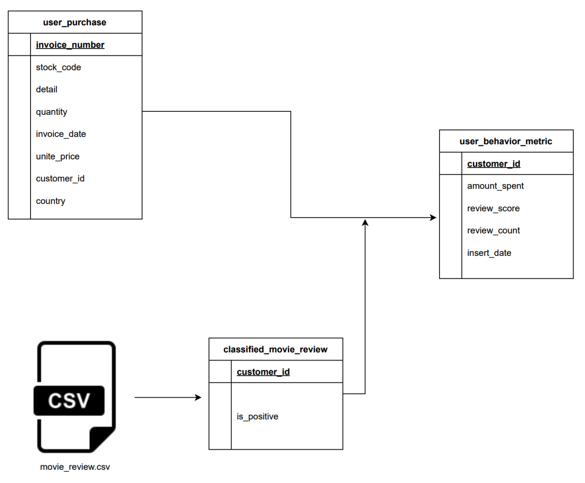
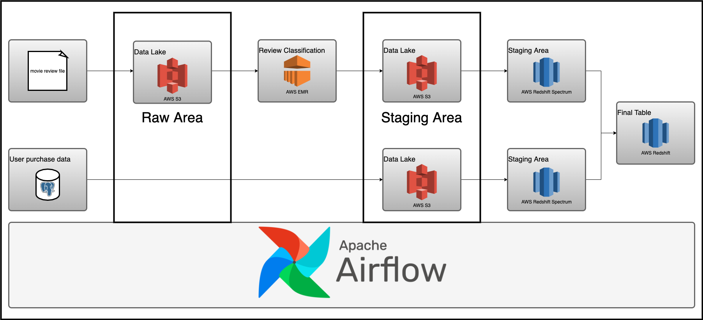
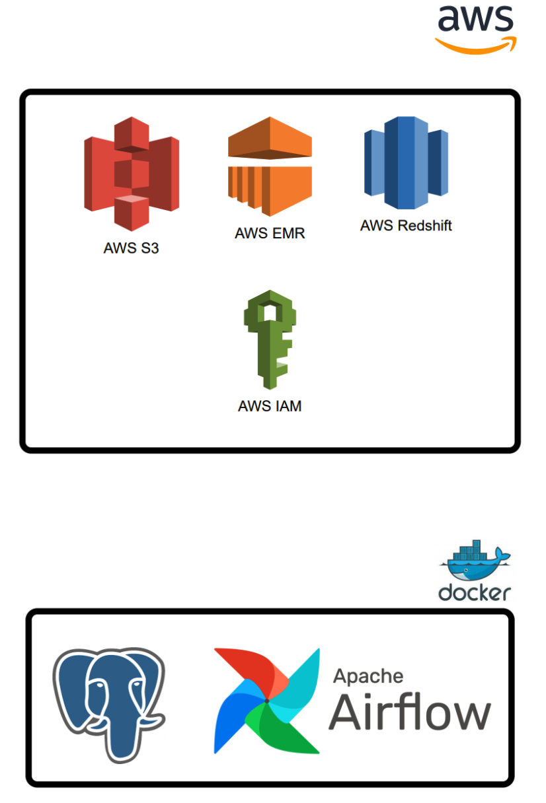

# User Behavior Project 

  - [1. Objective](#2-objective)
  - [2. Design](#3-design)
  - [3. Setup](#4-setup)
    - [3.1 Prerequisite](#41-prerequisite)
  - [4. Stop](#5-stop)
  - [5. Contributing](#6-contributing)

## 1. Objective

Assuming I work for a user behavior analytics company that collects user data and creates a user profile. I'm tasked with building a data pipeline to populate the `user_behavior_metric` table. The `user_behavior_metric` table is an OLAP table, meant to be used by analysts, dashboard software, etc. It is built from

1. `user_purchase`: OLTP table with user purchase information.
2. `movie_review.csv`: Data sent every day by an external data vendor.



## 2. Design

I will be using Airflow to orchestrate

1. Classifying movie reviews with Apache Spark.
2. Loading the classified movie reviews into the data warehouse.
3. Extracting user purchase data from an OLTP database and loading it into the data warehouse.
4. Joining the classified movie review data and user purchase data to get `user behavior metric` data.



## 3. Setup

### 3.1 Prerequisite

1. [Docker](https://docs.docker.com/engine/install/) with at least 4GB of RAM and [Docker Compose](https://docs.docker.com/compose/install/) v1.27.0 or later
2. [psql](https://blog.timescale.com/tutorials/how-to-install-psql-on-mac-ubuntu-debian-windows/)
3. [AWS account](https://aws.amazon.com/)
4. [AWS CLI installed](https://docs.aws.amazon.com/cli/latest/userguide/install-cliv2.html) and [configured](https://docs.aws.amazon.com/cli/latest/userguide/cli-chap-configure.html)

To set up the infrastructure and base tables I have a script called `setup_infra.sh`. This can be run as shown below.

```bash
git clone https://github.com/josephmachado/beginner_de_project.git
cd beginner_de_project
./setup_infra.sh {your-bucket-name}
```

This sets up the following components


log on to [www.localhost:8080](http://localhost:8080) to see the Airflow UI. The username and password are both `airflow`.

## 4. Stop

Script called `setup_infra.sh` stops AWS instances to avoid incurring charges and break down Airflow containers.

```bash
./spindown_infra.sh {your-bucket-name}
```

## 5. Contributing

Contributions are welcome. If you would like to contribute you can help by opening a github issue or putting up a PR.
